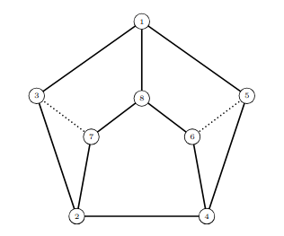

# Jaskinie

W Bajtocji jest wiele jaskiń. Oto mapa jednej z nich:



W Bajtocji każda z jaskiń ma następujące cechy:
* wszystkie komnaty i korytarze leżą na tym samym poziomie,
* korytarze nie przecinają się,
* część komnat leży na obwodzie jaskini — nazywamy je komnatami zewnętrznymi,
* wszystkie pozostałe komnaty, leżące wewnątrz, nazywamy komnatami wewnętrznymi,
* wejście do jaskini prowadzi do jednej z zewnętrznych komnat,
* z każdej komnaty wychodzą dokładnie trzy korytarze, prowadzące do trzech różnych innych
komnat; jeśli komnata jest zewnętrzna, to dwa spośród korytarzy prowadzą do sąsiednich
komnat zewnętrznych na obwodzie jaskini, a jeden do komnaty wewnętrznej,
* korytarze łączące zewnętrzne komnaty nazywamy korytarzami zewnętrznymi, a wszystkie
pozostałe korytarzami wewnętrznymi,
* z każdej komnaty można dojść do każdej innej komnaty korzystając jedynie z wewnętrz-
nych korytarzy, ale jeśli dodatkowo wymagamy by przez każdy korytarz przechodzić co
najwyżej raz, to można to zrobić tylko w jeden sposób,
* nie wszystkie korytarze są jednakowo łatwe do pokonania — dzielimy je na dwie kategorie:
łatwe i trudne.

Postanowiono udostępnić wszystkie jaskinie dla zwiedzających. Aby zapewnić płynny i bez-
pieczny przepływ zwiedzających, w każdej z jaskiń należy ustalić trasę zwiedzania, która prze-
chodzi dokładnie raz przez każdą komnatę.

Jedynym wyjątkiem od tej zasady jest komnata wejściowa, od której zwiedzanie się za-
czyna i na której się kończy (tzn. zwiedzający przechodzą przez tę komnatę dokładnie dwa
razy). Trasa zwiedzania powinna być przeznaczona dla przeciętnego turysty i zawierać jak
najmniej trudnych korytarzy.

### Przykład
Przyjrzyjmy się jaskini przedstawionej na rysunku. Komnata wejściowa ma numer 1. Trudne
korytarze są zaznaczone linią przerywaną. Trasa 1, 5, 4, 6, 8, 7, 2, 3 nie przechodzi przez
żaden z trudnych korytarzy. Trasa zwiedzania kończy się oczywiście w komnacie nr 1, chociaż
pomijamy tę jedynkę na końcu opisu trasy.
Zadanie
Napisz program, który:
* wczytuje opis jaskini z pliku tekstowego CAV.IN;
* znajduje trasę zwiedzania, która zaczyna i kończy się w komnacie wejściowej, przechodzi
przez każdą komnatę dokładnie raz oraz prowadzi przez jak najmniejszą liczbę trudnych
korytarzy;
* zapisuje wynik w pliku tekstowym CAV.OUT.

### Wejście
W pierwszym wierszu pliku tekstowego CAV.IN znajdują się dwie liczby całkowite n, k (oddzie-
lone pojedynczym odstępem). Liczba n, 3 < n ¬ 500 , to liczba wszystkich komnat w jaskini,
a k, k 3 , to liczba komnat zewnętrznych. Komnaty są ponumerowane od 1 do n. Kom-
nata wejściowa ma numer 1. Komnaty zewnętrzne mają numery 1 , 2 , . . . , k, aczkolwiek nie
muszą leżeć na obwodzie jaskini w tej kolejności. Kolejne 3 n/2 wiersze pliku zawierają opisy
korytarzy. Opis każdego korytarza składa się z trzech liczb całkowitych a, b, c, (oddzielonych
pojedynczymi spacjami). Liczby a i b są numerami komnat, które łączy korytarz. Liczba c jest
równa 0 lub 1 — 0 oznacza, że korytarz jest łatwy, a 1, że trudny.

### Wyjście
Twój program powinien zapisać w pierwszym wierszu pliku tekstowego CAV.OUT ciąg n liczb
całkowitych, pooddzielanych pojedynczymi odstępami. Pierwszą liczbą powinno być 1 (numer
komnaty wejściowej), a kolejnymi n − 1 liczbami powinny być numery kolejnych komnat trasy
zwiedzania.

### Przykład
Dla tekstowego pliku wejściowego CAV.IN:
```
8 5
1 3 0
3 2 0
7 3 1
7 2 0
8 7 0
1 8 0
6 8 0
6 4 0
6 5 1
5 4 0
2 4 0
5 1 0
```
jednym z poprawnych wyników jest następujący plik tekstowy CAV.OUT:
```
1 5 4 6 8 7 2 3
```